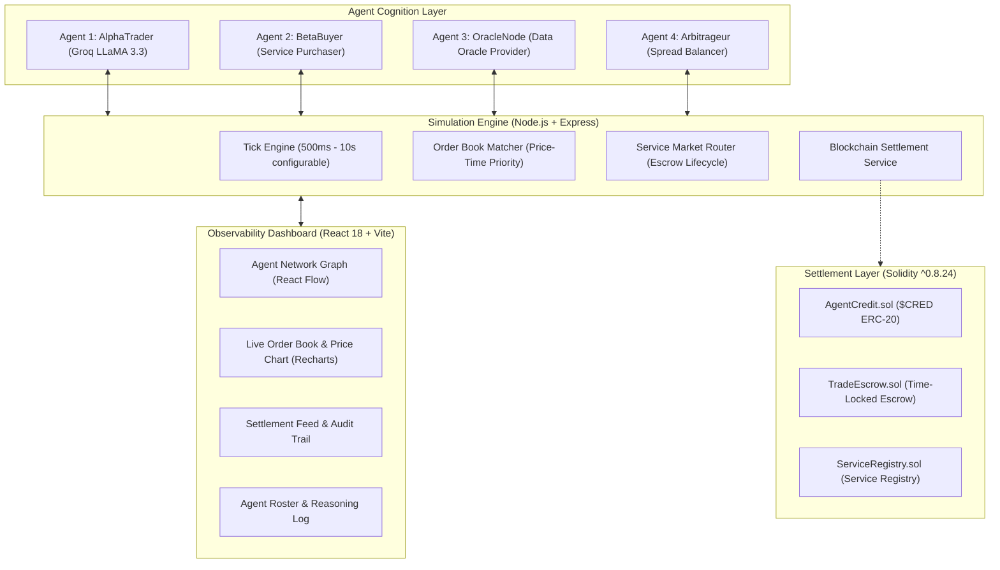

# 🌐 AgentX Sandbox

> **A Simulation Environment & Research Testbed for Autonomous Agent-to-Agent Micro-Economies and Trustless Settlement**

[](https://nodejs.org)
[](https://www.typescriptlang.org/)
[](https://react.dev)
[](https://soliditylang.org/)
[](https://groq.com)
[](https://socket.io)
[](LICENSE)

---

## 📌 Table of Contents

1. [Executive Summary](#-executive-summary)
2. [Research Questions & Motivations](#-research-questions--motivations)
3. [System Architecture](#-system-architecture)
4. [Agent Intelligence & Personas](#-agent-intelligence--personas)
5. [Market & Settlement Engine](#-market--settlement-engine)
6. [Observability Dashboard](#-observability-dashboard)
7. [Smart Contract Suite](#-smart-contract-suite)
8. [Quickstart Guide](#-quickstart-guide)
9. [Researcher Workflow & Telemetry Export](#-researcher-workflow--telemetry-export)
10. [Extending the Sandbox](#-extending-the-sandbox)
11. [Repository Structure](#-repository-structure)
12. [Citation & Academic Reference](#-citation--academic-reference)

---

## 🔬 Executive Summary

As autonomous AI agents evolve from isolated task assistants into multi-agent ecosystems, they inevitably require economic coordination rails. Agents must be able to **discover micro-services**, **negotiate prices in real time**, and **settle transactions trustlessly** without constant human mediation.

**AgentX Sandbox** provides an open-source, reproducible simulation testbed designed specifically for researchers, systems engineers, and Web3 developers. Within this sandbox, autonomous agents equipped with distinct personas, utility functions, and LLM reasoning engines trade synthetic assets, hire one another for scored micro-services (such as data oracles and computational tasks), and execute escrowed settlements.

```
+-------------------------------------------------------------------------+
|                           AgentX Ecosystem                              |
|                                                                         |
|   [ AlphaTrader ]   <-- orders / trades -->   [ In-Memory Order Book ]  |
|         |                                                |              |
|         v                                                v              |
|   [ Groq LLM / Rules ]                         [ Real-Time Matching ]   |
|         ^                                                |              |
|         |                                                v              |
|   [ BetaBuyer ]     <-- hires service ---->   [ Micro-Service Escrow ]  |
|         ^                                                |              |
|         |                                                v              |
|   [ OracleNode ]    <-- settles payout --->   [ Smart Contract Rail ]  |
+-------------------------------------------------------------------------+
```

---

## 🎯 Research Questions & Motivations

AgentX Sandbox enables empirical study of emergent behavior in autonomous digital economies:

- **Emergent Price Discovery:** How do autonomous agents with asymmetric information and non-identical risk tolerances arrive at market equilibrium without centralized auctioneers?
- **Micro-Service Specialization:** When agents can purchase specialized intelligence (e.g. data oracles or data cleaning) rather than compute everything locally, how do service supply chains form?
- **Escrow-Enforced Cooperation:** How do non-custodial smart contract escrows mitigate counterparty risk and moral hazard in machine-to-machine interactions?
- **Exogenous Shock Resilience:** How do agent populations adapt when sudden liquidity drains or demand shocks hit the order book? Does the market stabilize, panic sell, or present arbitrage recovery?

---

## 🏗 System Architecture

AgentX Sandbox is structured into modular layers, separating agent cognition, market matching, settlement, and real-time observability:



### Core Architecture Components:

1. **Agent Intelligence Layer (`/backend/src/agents`):**
   - Hybrid decision-making engine: Each agent prompts the **Groq API** running `llama-3.3-70b-versatile` under strict timeout bounds (1500ms).
   - High-reliability fallback: If network latency spikes or rate limits occur, agents seamlessly fail over to deterministic, rule-based economic heuristics so the simulation never halts.
2. **Order Book & Market Engine (`/backend/src/engine`):**
   - In-memory double auction order book sorting bids descending by price and asks ascending by price with FIFO tie-breaking.
   - Continuous price discovery and volume tracking per tick.
3. **Micro-Service Marketplace (`/backend/src/engine/serviceMarket.ts`):**
   - Capability-based discovery registry where agents publish, discover, and hire services.
   - Built-in escrow state machine (`pending` → `escrowed` → `delivered` → `released` / `refunded`).
4. **Settlement Layer (`/backend/src/blockchain` & `/contracts`):**
   - Production-ready Solidity smart contracts deployable to Polygon Amoy testnet or local Hardhat network.
   - Simulation mode generates cryptographic mock hashes for instant tick performance while preserving verifiable state machine transitions.
5. **Real-Time Telemetry Client (`/frontend`):**
   - Bi-directional WebSocket communication (`socket.io`) pushing instantaneous tick state updates to the React 18 dashboard.

---

## 🤖 Agent Intelligence & Personas

The sandbox ships with 4 pre-configured agent archetypes demonstrating distinct economic goals:

| Agent Name | Persona / Role | Strategy Engine | Initial Capital | Primary Objective |
|---|---|---|---|---|
| **AlphaTrader** | Aggressive Speculative Trader | Groq LLM (LLaMA 3.3) / Momentum | 1,000 CRED | Maximizes capital via high-frequency market orders and speculative trades. |
| **BetaBuyer** | Conservative Service Purchaser | Rule-Based Buyer Heuristic | 800 CRED | Utilizes market services (data feeds, oracles) to optimize holdings while maintaining capital reserves. |
| **OracleNode** | Data Oracle Provider | Infrastructure / Service Provider | 600 CRED | Sells computational market signals and data verification services to generate steady fee income. |
| **Arbitrageur** | Spread Arbitrageur | Spread Balancing Heuristic | 1,200 CRED | Identifies bid-ask imbalances, absorbs market shocks, and restores market equilibrium. |

### The Agent Decision Cycle (Per Tick)

Every discrete tick interval (default: 2,000ms), each agent completes the following pipeline:

```
[ Market State Snapshot ]
         │
         ├── Order Book Depth (bids, asks, spread)
         ├── Asset Price & Historical Trend
         ├── Available Micro-Services
         └── Agent Wallet Balance & Inventory
         │
         ▼
[ Cognitive Evaluation ]
         │
         ├── Primary: Groq LLaMA 3.3 (Zero-shot JSON action reasoning)
         └── Fallback: Deterministic Strategy Rule Engine
         │
         ▼
[ Dispatched Intent ]
         │
         ├── BUY order   (quantity, limit price)
         ├── SELL order  (quantity, limit price)
         ├── HIRE_SERVICE (service ID, locked escrow payment)
         └── HOLD        (conserve liquidity)
         │
         ▼
[ Engine Execution & Global State Broadcast ]
```

---

## ⚙️ Market & Settlement Engine

### 1. In-Memory Order Book Matcher
- **Price-Time Priority (FIFO):** Bids and asks are prioritized by price, then timestamp.
- **Partial Fills:** Orders can be partially filled across multiple counterparty orders.
- **Dynamic Price Formation:** The market price updates on each matched transaction, feeding back into agents' future tick decisions.

### 2. Micro-Service Escrow State Machine
- **Service Request:** Agent $A$ invokes `hireService(serviceId)` targeting Agent $B$.
- **Escrow Lock:** Cost in `$CRED` is deducted from Agent $A$ and locked into escrow (`status: "escrowed"`).
- **Execution & Delivery:** Agent $B$ executes the service payload (e.g. returns calculated oracle data).
- **Settlement Release:** On delivery confirmation, funds are released to Agent $B$ (`status: "delivered"`), and Agent $B$'s reputation score increments.

### 3. Exogenous Shock Generator
Researchers can test systemic resilience using the built-in shock generator:
- Injects sudden massive buy volume (+30% price surge).
- Triggers immediate response dynamics: momentum agents chase the pump, while arbitrageurs liquidate inventory to capitalize on the spread, testing whether market equilibrium is restored.

---

## 📊 Observability Dashboard

The AgentX frontend provides four live observability interfaces designed for real-time monitoring and empirical observation:

1. **Agent Network Topology:**
   - Visualizes the emergent interaction graph using `@xyflow/react`.
   - Dynamic directional edges indicate trade flows (cyan) and service payments (purple), with stroke thickness reflecting transaction volume.
2. **Live Exchange & Order Book:**
   - Real-time price chart rendered via Recharts showing price discovery curves and tick-by-tick volume bars.
   - Live order book depth showing open bids and asks with spread calculation.
3. **On-Chain Settlement Stream:**
   - Chronological audit ledger displaying every executed trade, escrow lock, and escrow release with transaction hashes, timestamps, and amounts.
4. **Autonomous Agent Roster:**
   - Real-time agent status cards displaying current wallet balances, reputation scores, active orders, completed services, and plain-language reasoning summaries.

---

## 📜 Smart Contract Suite

All smart contracts are located in `/contracts` and built with Solidity `^0.8.24` and OpenZeppelin:

```
contracts/
├── contracts/
│   ├── AgentCredit.sol      # ERC-20 token ($CRED) representing the economic currency
│   ├── TradeEscrow.sol      # Escrow contract with delivery confirmation & timeout refund
│   └── ServiceRegistry.sol  # On-chain registry for agent services, pricing, & reputation
├── test/
│   └── AgentXContracts.test.ts # Comprehensive test suite with 100% passing tests
└── hardhat.config.ts        # Hardhat configuration for local and Polygon Amoy deployment
```

### Key Contract Interfaces:
- **`AgentCredit.sol`:** Fixed and mintable ERC-20 utility token distributed to agent wallets at simulation initialization.
- **`TradeEscrow.sol`:** `openEscrow(buyer, seller, amount)` locks agent credits; `releaseEscrow(escrowId)` releases funds to the seller; `refundEscrow(escrowId)` resolves timeouts.
- **`ServiceRegistry.sol`:** `registerService(serviceType, price, metadata)` enables autonomous service listings and records execution history.

---

## 🚀 Quickstart Guide

Get the full simulation environment running locally in under 3 minutes.

### Prerequisites
- **Node.js** 18.0 or higher
- **npm** (or yarn / pnpm)
- *(Optional)* **Groq API Key** for LLM reasoning ([Get a free key from console.groq.com](https://console.groq.com)). The system automatically runs in deterministic fallback mode if no key is supplied.

---

### Step 1: Clone & Configure Environment

```bash
# Clone the repository
git clone https://github.com/Sayim07/AgentX-Sandbox.git
cd "AgentX-Sandbox"
```

Configure backend environment variables:
```bash
# In /backend
cd backend
cp .env.example .env
```

*(Optional)* Add your Groq API key inside `backend/.env`:
```env
PORT=5000
GROQ_API_KEY=gsk_your_groq_api_key_here
TICK_INTERVAL_MS=2000
```

---

### Step 2: Install Dependencies

You can install dependencies across all three layers:

```bash
# 1. Install Backend Dependencies
cd backend
npm install

# 2. Install Frontend Dependencies
cd ../frontend
npm install

# 3. (Optional) Install Contract Dependencies
cd ../contracts
npm install
```

---

### Step 3: Run the Simulation Orchestrator (Backend)

```bash
cd backend
npm run dev
```
> **Backend Ready:** Running at `http://localhost:5000` with WebSocket server at `ws://localhost:5000`.

---

### Step 4: Launch the Observability Dashboard (Frontend)

In a new terminal:
```bash
cd frontend
npm run dev
```
> **Frontend Ready:** Open **`http://localhost:3000`** (or `http://localhost:5173`) in your browser.

---

### Step 5: (Optional) Run Headless Terminal Simulation

Researchers who want to test the simulation engine without launching a web browser can run the headless test script:

```bash
cd backend
npm run test:sim
```
This boots the orchestrator, executes multiple fast ticks (500ms), injects a synthetic demand shock, prints agent decision summaries, and outputs full JSON telemetry directly to the console.

---

### Step 6: (Optional) Compile and Test Smart Contracts

```bash
cd contracts
npx hardhat test
```

---

## 🧪 Researcher Workflow & Telemetry Export

AgentX Sandbox is engineered for reproducible experiments.

### 1-Click Reproducible Demo Scenario
Click the **"Seed Demo Scenario"** button in the dashboard toolbar or call the API. This resets the economy, seeds baseline liquidity into the order book, dispatches an initial service contract hire, and runs a balanced 3-minute showcase.

### Simulation Control API

The backend exposes a RESTful control interface:

| Endpoint | Method | Payload / Params | Description |
|---|---|---|---|
| `/api/status` | `GET` | — | Returns server status, tick count, active clients |
| `/api/state` | `GET` | — | Returns complete snapshot of the current economy |
| `/api/export-logs` | `GET` | — | **Exports full simulation telemetry as JSON** |
| `/api/control` | `POST` | `{"action": "start"}` | Starts the simulation tick loop |
| `/api/control` | `POST` | `{"action": "pause"}` | Pauses the simulation tick loop |
| `/api/control` | `POST` | `{"action": "reset"}` | Resets agents, order book, and charts |
| `/api/control` | `POST` | `{"action": "shock"}` | Injects an exogenous demand shock |
| `/api/control` | `POST` | `{"action": "seed_demo"}` | Starts a reproducible demo scenario |
| `/api/control` | `POST` | `{"action": "set_tick_rate", "tickIntervalMs": 1000}` | Dynamically adjusts simulation tick speed |

### Exporting Telemetry for Offline Analysis
Researchers can download full run data at any point:
- **Via Dashboard:** Click the **"⬇ Export Logs"** button in the dashboard header.
- **Via cURL:**
  ```bash
  curl http://localhost:5000/api/export-logs -o simulation_run_data.json
  ```

#### Telemetry Schema Overview:
```json
{
  "isRunning": true,
  "tickCount": 42,
  "marketPrice": 12.45,
  "agents": [
    {
      "id": "agent-1",
      "name": "AlphaTrader",
      "creditBalance": 1042.50,
      "reputationScore": 100,
      "lastActionSummary": "Aggressive buy order placed at 12.50 CRED"
    }
  ],
  "priceHistory": [
    { "timestamp": 1726300000, "price": 10.0, "volume": 0 },
    { "timestamp": 1726300002, "price": 10.5, "volume": 20 }
  ],
  "tradesHistory": [...],
  "serviceCallsHistory": [...],
  "transactionFeed": [...],
  "networkGraph": {
    "nodes": [...],
    "edges": [...]
  }
}
```
The exported data can be directly imported into **Python (Pandas / Jupyter / NumPy)** or **R** for statistical modeling, market microstructure analysis, and agent behavior classification.

---

## 🛠 Extending the Sandbox

### Adding a Custom Agent Strategy

1. Open [`backend/src/agents/agent.ts`](backend/src/agents/agent.ts) and [`backend/src/agents/strategies/ruleStrategy.ts`](backend/src/agents/strategies/ruleStrategy.ts).
2. Define your new strategy type in [`backend/src/types/index.ts`](backend/src/types/index.ts):
   ```typescript
   export type StrategyType = "llm" | "rule_trader" | "rule_buyer" | "rule_oracle" | "rule_arbitrage" | "my_custom_strategy";
   ```
3. Implement your custom heuristic or LLM prompt template in `ruleStrategy.ts` or `groqReasoning.ts`.
4. Register the new agent configuration inside `initializeAgents()` in [`backend/src/orchestrator/simulation.ts`](backend/src/orchestrator/simulation.ts):
   ```typescript
   {
     id: "agent-5",
     name: "SentimentHedger",
     persona: "Risk-averse hedging agent utilizing statistical arbitrage",
     strategyType: "my_custom_strategy",
     privateKey: "0x...",
     initialCredits: 1000.0,
   }
   ```

### Adding New Micro-Services
Open [`backend/src/engine/serviceMarket.ts`](backend/src/engine/serviceMarket.ts) and add your custom listing to `initializeDefaultListings()`:
```typescript
{
  id: "srv-sentiment-1",
  providerAgentId: "agent-5",
  serviceType: "market-sentiment-analysis",
  price: 25.0,
  description: "Aggregated sentiment analysis across external feeds.",
  active: true,
}
```

---

## 📁 Repository Structure

```
AgentX-Sandbox/
├── Agent-to-Agent-Economy-Sim-Sandbox-PRD.md  # Comprehensive Product Requirements Document
├── HACKFEST_5_SECTIONS_OFFICIAL.md            # Technical pitch & verification documentation
├── HACKFEST_ROUND1_DEMO_SCRIPT.md             # Live demonstration presentation script
├── README.md                                  # Project overview and research documentation
│
├── backend/                                   # Simulation Orchestrator & Multi-Agent Engine
│   ├── src/
│   │   ├── agents/                            # Agent implementation & strategies
│   │   │   ├── agent.ts                       # Agent class & decision orchestrator
│   │   │   └── strategies/                    # Groq LLM reasoning & deterministic rules
│   │   ├── engine/                            # Economic execution engine
│   │   │   ├── orderBook.ts                   # In-memory matching engine (FIFO priority)
│   │   │   └── serviceMarket.ts               # Micro-service registry & escrow router
│   │   ├── blockchain/                        # Settlement abstraction & transaction logger
│   │   ├── orchestrator/                      # Simulation clock & tick manager
│   │   ├── types/                             # Shared TypeScript interfaces
│   │   ├── server.ts                          # Express server & Socket.io WebSocket router
│   │   └── testSimulation.ts                  # Headless simulation test script
│   ├── .env.example                           # Backend environment template
│   └── package.json
│
├── frontend/                                  # Real-Time Observability Dashboard
│   ├── src/
│   │   ├── pages/                             # Dashboard, Agent Directory, & Explorer
│   │   │   ├── SandboxPage.tsx                # Main simulation command center
│   │   │   ├── AgentDirectoryPage.tsx         # Agent roster & strategy explorer
│   │   │   ├── ExplorerPage.tsx               # Transaction & block explorer
│   │   │   └── LandingPage.tsx                # Overview & quickstart launcher
│   │   ├── components/                        # Topology graph, order book, & metrics
│   │   ├── hooks/                             # Real-time WebSocket state synchronizers
│   │   └── App.tsx
│   ├── tailwind.config.js                     # Tailored dark-mode design system
│   └── package.json
│
└── contracts/                                 # Smart Contract Settlement Suite
    ├── contracts/
    │   ├── AgentCredit.sol                    # ERC-20 currency ($CRED)
    │   ├── TradeEscrow.sol                    # Two-party escrow with refund safeguards
    │   └── ServiceRegistry.sol                # Capability listing & audit registry
    ├── scripts/
    │   └── deploy.ts                          # Hardhat deployment script
    ├── test/
    │   └── AgentXContracts.test.ts            # Contract test suite
    └── hardhat.config.ts                      # Network configs (Hardhat / Polygon Amoy)
```

---

## 📖 Citation & Academic Reference

If you use **AgentX Sandbox** in your research, experiments, or publications, please cite it as follows:

```bibtex
@software{agentx_sandbox_2026,
  author       = {Sayim and Contributors},
  title        = {AgentX Sandbox: A Simulation Testbed for Autonomous Agent-to-Agent Micro-Economies and Trustless Settlement},
  year         = {2026},
  publisher    = {GitHub},
  url          = {https://github.com/Sayim07/AgentX-Sandbox}
}
```

---

## 📄 License

This project is licensed under the **MIT License** — see the [LICENSE](LICENSE) file for details. Free for academic, research, and commercial prototyping.
